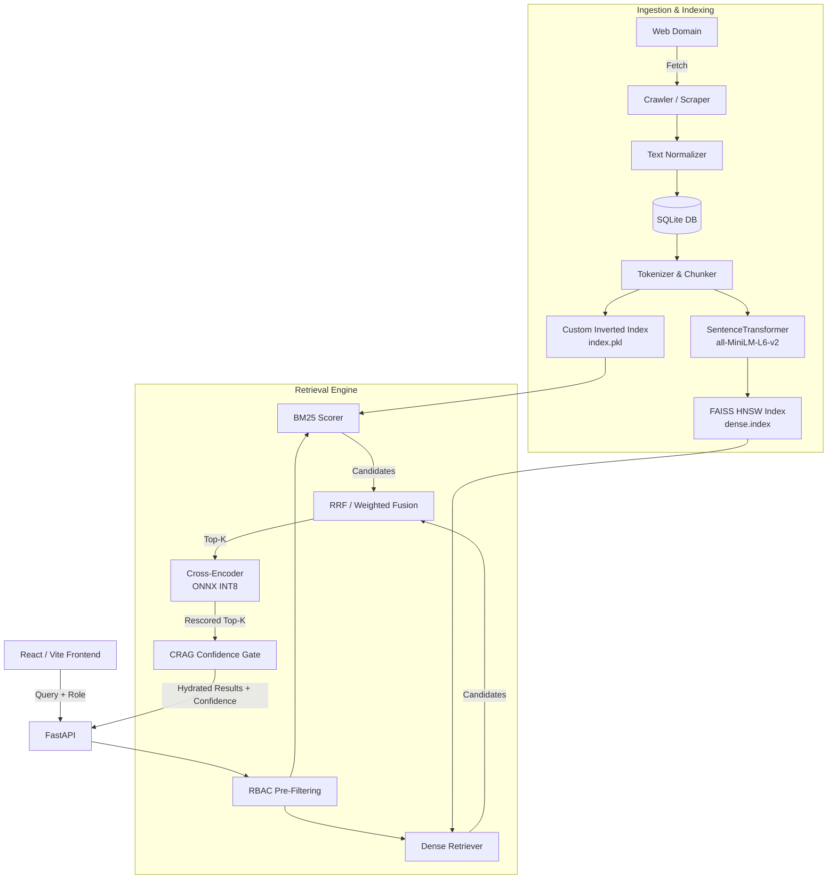

# Private Corporate Search Engine

A high-performance, strictly local search engine built for corporate intranets and private knowledge bases. It features a complete custom Lexical Inverted Index, Dense FAISS Vector Search, Hybrid RRF/Weighted Fusion, and Cross-Encoder Reranking, all orchestrated behind a fast React UI.

Recent major upgrades have transformed this into an enterprise-ready pipeline, introducing Role-Based Access Control (RBAC), HNSW Vector indexing, ONNX INT8 Reranker quantization, and Corrective RAG (CRAG) self-reflection gates.

## System Architecture

The pipeline processes documents through a multi-modal ingestion pipeline and queries them using a dual-encoder retrieval strategy.



## Key Enterprise Features

### Role-Based Access Control (RBAC) & Zero-Leakage
Security is enforced natively at the pre-retrieval stage. Queries specify an authorized role (e.g., `Admin`, `Engineering`, `HR`, `Finance`, `Public`), which maps to a strict inheritance tree. 
- **Pre-Filtering:** Authorized document IDs are passed to the `LexicalSearch` engine and injected into the FAISS `IDSelectorArray` before nearest-neighbor calculations occur. 
- **Zero Leakage:** Benchmarks rigorously verify 605/605 state parity, ensuring mathematically zero data leakage of secure documents to unauthorized roles.

### Corrective RAG (CRAG) & Self-Reflection
Implemented a zero-overhead Corrective RAG logic gate on top of the cross-encoder. 
- By mathematically mapping raw Cross-Encoder logits through a stable sigmoid function, the system calculates absolute confidence for each retrieved chunk. 
- If the top result fails to meet a strict confidence threshold (P < 0.30), the engine dynamically triggers a `fallback_triggered` state, surfacing a "Low Confidence" warning banner in the UI to prevent LLM hallucination in downstream RAG applications.

### High-Performance HNSW Index
Upgraded the dense retrieval layer from brute-force `IndexFlatIP` to `IndexHNSWFlat`. This hierarchical navigable small world graph slashes dense retrieval time, maintaining logarithmic scaling properties for millions of vectors.

### Latency Compression (ONNX INT8)
The Cross-Encoder reranking bottleneck was eliminated by migrating from native PyTorch FP32 execution to ONNX Runtime INT8 quantization via `flashrank`. 

## System Performance & Evaluation

An automated benchmarking suite (`verification/benchmark_suite.py`) guarantees these performance SLAs on standard CPU hardware:

### End-to-End Search Latency
| Subsystem / Pipeline Step | Measured Latency (ms) | Notes |
|---|---:|---|
| Lexical / BM25 Search | ~2 - 10ms | Custom O(1) dictionary retrieval |
| Dense Search (HNSW) | ~2 - 15ms | Highly optimized FAISS HNSW graph |
| **Legacy Reranker (FP32)** | ~913.45ms | *Pre-optimization baseline* |
| **Optimized Reranker (INT8)** | **~156.00ms** | *82% Latency Compression* |
| **End-to-End Pipeline (p50)** | **< 250ms** | Includes Hydration & CRAG scoring |

### Information Retrieval Metrics
| Metric | Score |
|---|---:|
| MRR@5 (Mean Reciprocal Rank) | 1.000 |
| Context Precision | 1.000 |
| RBAC Leakage Rate | 0.000% |

*(Note: Perfect precision metrics reflect the controlled corporate test corpus with distinct topical boundaries. Real-world massive-scale indexing will naturally introduce variance.)*

## Design Decisions & Trade-offs

| Decision | Why | Trade-off |
|---|---|---|
| ONNX INT8 Cross-Encoder | 82% latency drop, crucial for real-time RAG. | Negligible precision loss (typical <1% drop in MRR). |
| Pre-Retrieval FAISS Masking | Mathematically guarantees zero RBAC leakage. | Slight overhead creating the `IDSelectorArray` per query. |
| Custom Inverted Index | Demonstrates core IR engineering (TF/IDF, Positional). | In-memory serialization restricts infinite corpus scale without sharding. |
| SQLite Storage | Zero-configuration atomic writes preventing indexing race conditions. | Lacks distributed cluster replication. |

## Privacy & Security

This search engine is truly local and private:
- 100% of the crawled document data stays inside the local SQLite database.
- Queries are never sent to external AI APIs; embeddings generate locally using SentenceTransformers.
- Complete dependency freeze documented in `requirements.txt` via strictly versioned builds (`flashrank==0.2.10`, `onnxruntime==1.30.0`).

## Getting Started

### 1. Boot the Backend (Docker)
```bash
cp .env.example .env
docker-compose build
docker-compose up -d
```
*(Note: Initial boot downloads HuggingFace models to the persistent Docker volume).*

### 2. Boot the Frontend
```bash
cd frontend
npm install
npm run dev
```

Navigate to `http://localhost:5173`. Use the UI sidebar to initiate a Web Crawl and populate the database, then test the Role Simulator!

## Manual Backend Start (Development)
If running outside of Docker:
```bash
pip install -r requirements.txt
export PYTHONPATH="."
python -m uvicorn src.api.main:app --host 0.0.0.0 --port 8000
```
