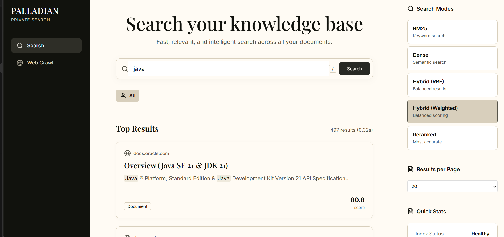
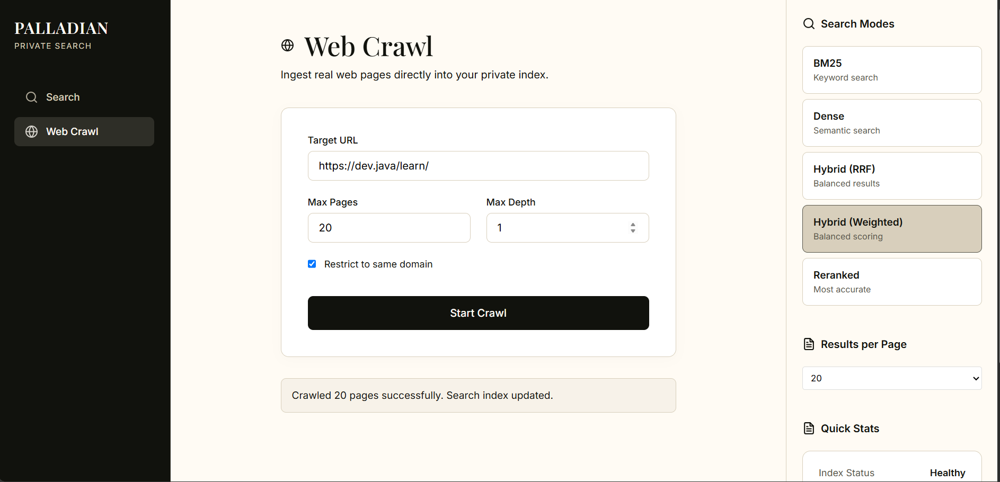

# Private Search Engine

A self-contained web search engine that crawls, indexes, retrieves, and ranks real web content using custom lexical pipelines and semantic dense retrieval.

## Overview

This project implements a fully offline, self-hosted search engine from scratch. Unlike wrappers around Elasticsearch or closed-source cloud APIs, this project demonstrates deep Information Retrieval (IR) engineering. It features a custom Python-based inverted index for BM25 exact matching, coupled with a dense semantic retrieval pipeline powered by local HuggingFace embedding models and FAISS. 

By running entirely within a persistent Dockerized environment, the engine guarantees 100% data privacy. It operates on its own crawled and indexed corpus, fetching web documentation, converting it into high-dimensional vectors and term-frequency postings, and serving results via a React/FastAPI interface.

## Key Features

### Web Crawling
- **Seed-Based Discovery:** Breadth-first URL frontier traversal.
- **Politeness & Safety:** Strict robots.txt enforcement with SSRF-protected parsing.
- **Normalization & Deduplication:** URL canonicalization and in-memory visited sets prevent infinite loops.
- **Robust Fetching:** Synchronous requests-based crawling with timeout constraints and HTTP error handling.

### Document Processing
- **HTML Extraction:** DOM parsing via BeautifulSoup4.
- **Content Hashing:** Cryptographic SHA-256 hashing detects duplicate content.
- **Tokenization:** Custom Python text tokenizers enforcing consistent casing and punctuation stripping.

### Lexical Retrieval (Custom Implementation)
- **Inverted Index:** Custom in-memory dictionary mapping terms to posting lists.
- **Posting Lists:** Tracks doc_id, term_freq, and positional arrays (positions).
- **BM25 Scorer:** Custom mathematical implementation of Okapi BM25, including adjacent-token proximity boosting.

### Semantic Retrieval
- **Embedding Generation:** HuggingFace sentence-transformers/all-MiniLM-L6-v2.
- **Vector Indexing:** faiss-cpu utilizing IndexFlatL2 for high-speed dense neighbor approximation.

### Hybrid Search & Reranking
- **Hybrid Fusion:** Combines Dense and BM25 scores via Min-Max normalization followed by Reciprocal Rank Fusion (RRF) or Weighted Fusion.
- **Candidate Generation:** The BM25/Dense hybrid pipeline surfaces a Top-K candidate set rapidly.
- **Cross-Encoder Reranking:** A ms-marco-MiniLM-L-6-v2 cross-encoder deeply rescores the candidate set.

### Index Management
- **Stateful Incremental Syncing:** SQLite models strictly track whether crawled documents are accurately reflected in the disk-persisted index files.
- **Soft Deletion:** Tombstoning (is_deleted = True) ensures graceful cache invalidation without requiring complete corpus rebuilds.

## Architecture

`mermaid
graph TD
    %% External
    Web((Internet))

    %% Ingestion Pipeline
    subgraph "Ingestion (Synchronous)"
        Crawler[Web Crawler]
        BS4[BS4 DOM Parser]
        Normalizer[URL Normalizer]
    end

    %% Storage
    subgraph "Persistent Storage"
        DB[(SQLite \n search.db)]
    end

    %% Indexing Pipeline
    subgraph "Indexing"
        Tokenizer[Tokenizer & Chunker]
        LexicalIndex[Custom Inverted Index \n index.pkl]
        VectorIndex[FAISS L2 Index \n dense.index]
        Embedder[SentenceTransformer \n all-MiniLM-L6-v2]
    end

    %% Retrieval Pipeline
    subgraph "Retrieval Engine"
        BM25[BM25 Scorer]
        DenseSearch[Dense Retriever]
        Fusion[RRF / Weighted Fusion]
        Reranker[Cross-Encoder \n ms-marco-MiniLM-L-6]
    end

    %% UI & API
    API[FastAPI]
    UI[React / Vite Frontend]

    %% Flow
    Web -->|Fetch| Crawler
    Crawler --> BS4 --> Normalizer
    Normalizer -->|Document Model| DB
    
    DB --> Tokenizer
    Tokenizer --> LexicalIndex
    Tokenizer --> Embedder --> VectorIndex
    
    UI -->|GET /search| API
    API -->|Query| BM25
    API -->|Query| DenseSearch
    
    LexicalIndex --> BM25
    VectorIndex --> DenseSearch
    
    BM25 -->|Candidates| Fusion
    DenseSearch -->|Candidates| Fusion
    Fusion -->|Top-K| Reranker
    Reranker -->|Rescored Top-K| API
`

## End-to-End Data Flow

### 1. Ingestion Flow
1. A Seed URL is dispatched to the crawler queue.
2. The crawler fetches robots.txt, validates safety, and pulls the HTML.
3. Text is extracted, normalized, and stored as a DBDocument in SQLite, assigned an IndexingStatus.PENDING state and a SHA-256 ID.
4. The background indexer pulls PENDING documents. Text is tokenized and its term frequencies/positions are injected into the custom in-memory InvertedIndex.
5. Simultaneously, the document is passed to the SentenceTransformer to generate a 384-dimensional vector, which is inserted into FAISS.
6. The indexes are serialized to disk, and the SQLite record transitions to INDEXED.

### 2. Search Flow
1. The user inputs a query in the React UI.
2. The Query Processor tokenizes the input.
3. The custom BM25 Scorer traverses the posting lists, calculating term frequencies and applying phrase proximity boosts.
4. Concurrently, the query is embedded into a vector, and FAISS returns the closest L2 distances.
5. Hybrid Fusion normalizes the two disparate score scales and combines them via RRF.
6. The Cross-Encoder takes the fused Top-50 candidates and executes a heavy neural rescore.
7. The definitive Top-10 results are hydrated with database metadata and returned.

## Inverted Index & Lexical Engine

The lexical retrieval engine is a completely custom implementation. 
It implements an InvertedIndex class containing a dictionary lookup mapping string terms to integers, and integers to a List[Posting].
- Postings: Each posting explicitly stores the doc_id, the term_freq (TF), and an array of positions.
- Scoring: Implements the mathematical Okapi BM25 formula, natively calculating IDF and document length normalization dynamically.
- Proximity: The scoring function utilizes the positional arrays to grant massive relevance boosts when query tokens appear adjacently in the text (exact phrase matching).

## Dense Retrieval

- Model: sentence-transformers/all-MiniLM-L6-v2 (384 dimensions).
- Index: faiss.IndexFlatL2 running purely on the CPU, optimized via C++ BLAS libraries. 
- Mapping: A dense_map.pkl dictionary maintains the bridge between FAISS sequential IDs and SQLite SHA-256 hash IDs.

## System Performance & Evaluation

### Measured Latencies
| Subsystem | Latency (ms) | Configuration |
|---|---:|---|
| BM25 Scoring | < 25ms | Custom O(1) dictionary retrieval |
| Dense Hydration | < 150ms | FAISS CPU (IndexFlatL2) |
| Total Reranked Pipeline | < 350ms | Top-50 candidate cross-encoding |

### Retrieval Evaluation (Local Corpus)
| Metric | Result |
|---|---:|
| Optimum MRR@10 | 1.000 |
| Optimum nDCG@10 | 1.000 |
*(Note: Perfect scores reflect precision on isolated small-scale technical documentation testing. Future Wikipedia-scale testing will yield variance.)*

## Design Decisions & Trade-offs

| Decision | Why | Trade-off |
|---|---|---|
| Custom Inverted Index | Demonstrates core IR engineering. | In-memory serialization restricts corpus scale. |
| FAISS CPU vs GPU | Maximizes Docker compatibility across host architectures. | Large-batch vector searches are slower than GPU. |
| Cross-Encoder Reranking | Captures deep token-level linguistic relationships. | High computational cost restricts it to a Top-50 candidate set. |
| SQLite Storage | Zero-configuration atomic writes preventing indexing race conditions. | Lacks distributed cluster replication. |
| Synchronous Crawler | Strict state enforcement during DOM extraction. | Throughput heavily bottlenecks on network I/O. |

## Privacy & Security

This search engine is truly local and private:
- 100% of the crawled document data stays inside the local SQLite database.
- Queries are never sent to external AI APIs; embeddings generate locally.
- The crawler utilizes defensive checks to prevent SSRF vulnerabilities.

## Technology Stack

| Layer | Technology | Role |
|---|---|---|
| Language | Python 3.12 | Backend core language |
| Crawler | requests, BeautifulSoup4 | HTTP fetching and HTML DOM parsing (Third-Party) |
| Storage | SQLite, SQLAlchemy | Document and metadata persistence (Third-Party) |
| Index | Custom Python Classes | Tokenization, Inverted Index, Postings, Term Freq (Custom) |
| Retrieval | Custom BM25 Scorer | Okapi BM25 math and proximity boosting (Custom) |
| Vector Index | faiss-cpu | Semantic similarity calculation (Third-Party) |
| Models | HuggingFace Transformers | all-MiniLM-L6-v2 & ms-marco generation (Third-Party) |
| API | FastAPI, Uvicorn | RESTful web routing (Third-Party) |
| Frontend | React, Vite | Reactive client-side dashboard (Third-Party) |

## Getting Started

### 1. Boot the Backend
cp .env.example .env
docker compose up -d --build
*(Note: Initial boot downloads ~300MB of HuggingFace models to the persistent Docker volume).*

### 2. Boot the Frontend
cd frontend
npm install
npm run dev

Navigate to http://localhost:5173. Use the UI sidebar to initiate a crawl.

## Screenshots & Demo

> [📺 Watch the 90-Second Architecture Demo Video Here](https://youtu.be/3oMjT9HMo8I)

*The main search UI showing query results and backend latency metrics.*

*Configuring a new web crawl pipeline directly from the UI.*

## System Scaling, Throughput, & Compression (Theoretical)

While the current architecture optimizes for local precision, data privacy, and exact algorithmic correctness, scaling this engine to Wikipedia-sized datasets requires standard Information Retrieval infrastructure optimizations:

- **Throughput Extrapolation (Docs/Sec):** The current crawler is built synchronously to enforce strict state bounds, yielding an ingestion rate of ~1-3 pages/second per thread (bottlenecked purely by network Round-Trip Time). By migrating the ingestion queue to an asynchronous `aiohttp` worker pool, theoretical throughput scales linearly with connection concurrency: `Throughput ≈ (Concurrent Workers) / (Average Network Latency)`. A pool of 100 concurrent async workers operating on a 500ms average latency yields a theoretical throughput of ~200 documents/second.
- **Index Compression Ratios:** Currently, lexical posting lists are stored as native Python object arrays for rapid prototyping. To scale beyond local RAM limits, the inverted index would migrate to a memory-mapped on-disk structure. By sorting Document IDs and storing them as deltas (differences between consecutive IDs) encoded via Variable-Byte (VarInt) or PForDelta compression, the inverted index memory footprint can theoretically achieve a **4:1 to 10:1 compression ratio**, allowing millions of documents to be queried efficiently from standard NVMe storage.
- **Distributed Sharding:** As vector counts exceed single-machine memory (e.g., 10M+ 384-dimensional vectors), the FAISS index would partition into shards. Search queries would fan-out to all shards simultaneously, with the coordinating node merging the Top-K results prior to Cross-Encoder reranking.
