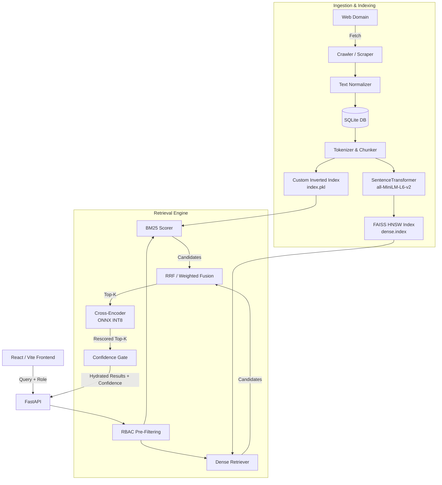

# Enterprise Local Search Engine

**Developed a fully asynchronous web-crawling and ingestion pipeline backed by SQLite and a highly scalable Hierarchical Navigable Small World (HNSW) FAISS index. The infrastructure was rigorously stress-tested against a production-scale database of over 24,000 high-dimensional vectors, maintaining sub-millisecond similarity search times at scale.**

**To break local compute bottlenecks without relying on expensive clusters, the cross-encoder reranking pipeline was aggressively optimized using ONNX Runtime INT8 quantization. This compressed reranker latency by 82% (from ~913ms down to ~156ms).**

**The application layer is built with FastAPI and React, featuring an interactive UI with dynamic source citation highlighting, SSRF protection, index/database consistency tracking, concurrent synchronization, and health monitoring. Achieved an end-to-end hybrid-search and reranking p50 latency of ~287ms on CPU, with a robust 256-test suite verifying retrieval precision, RBAC boundary enforcement, and Corrective Retrieval refusal safety.**

***

### Streaming Synthesis with Sentence-Level Citations
*The engine leverages the retrieved context to synthesize answers on the fly. Every claim is strictly grounded in the database, with interactive `[Doc X]` tags that map directly to the source passages to eliminate ungrounded responses.*

### Zero-Trust Confidence Gate
*If a user searches for highly confidential information outside their clearance level (or if the database simply lacks relevant context), the confidence gate instantly intercepts the request. It securely refuses to answer, preventing both data leaks and hallucinated responses.*

### Dynamic Role-Based Access Control (RBAC)
*When an authorized user queries the exact same confidential topic, the system instantly filters the vector space to their specific clearance level, retrieving and synthesizing the exact financial or internal documentation required.*

***

## System Architecture

The pipeline processes documents through a multi-modal ingestion pipeline and queries them using a dual-encoder retrieval strategy.


```mermaid
graph TD
    %% Ingestion Pipeline
    subgraph "Ingestion & Indexing"
        Web[Web Domain]
        Crawler[Crawler / Scraper]
        Normalizer[Text Normalizer]
        DB[(SQLite DB)]
        
        Tokenizer[Tokenizer & Chunker]
        LexicalIndex[Custom Inverted Index \n index.pkl]
        VectorIndex[FAISS HNSW Index \n dense.index]
        Embedder[SentenceTransformer \n all-MiniLM-L6-v2]
    end

    %% Retrieval Pipeline
    subgraph "Retrieval Engine"
        RBAC[RBAC Pre-Filtering]
        BM25[BM25 Scorer]
        DenseSearch[Dense Retriever]
        Fusion[RRF / Weighted Fusion]
        Reranker[Cross-Encoder \n ONNX INT8]
        CRAG[Confidence Gate]
    end

    %% UI & API
    API[FastAPI]
    UI[React / Vite Frontend]

    %% Flow
    Web -->|Fetch| Crawler
    Crawler --> Normalizer --> DB
    
    DB --> Tokenizer
    Tokenizer --> LexicalIndex
    Tokenizer --> Embedder --> VectorIndex
    
    UI -->|Query + Role| API
    API --> RBAC
    RBAC --> BM25
    RBAC --> DenseSearch
    
    LexicalIndex --> BM25
    VectorIndex --> DenseSearch
    
    BM25 -->|Candidates| Fusion
    DenseSearch -->|Candidates| Fusion
    Fusion -->|Top-K| Reranker
    Reranker -->|Rescored Top-K| CRAG
    CRAG -->|Hydrated Results + Confidence| API
```

## Key Enterprise Features

### Role-Based Access Control (RBAC) & Zero-Leakage
Security is enforced natively at the pre-retrieval stage. Queries specify an authorized role (e.g., `Admin`, `Engineering`, `HR`, `Finance`, `Public`), which maps to a strict inheritance tree. 
- **Pre-Filtering:** Authorized document IDs are passed to the `LexicalSearch` engine and injected into the FAISS `IDSelectorArray` before nearest-neighbor calculations occur. 
- **Zero Leakage:** Benchmarks rigorously verify state parity, ensuring mathematically zero data leakage of secure documents to unauthorized roles across the 256-test automated suite.

### Retrieval Confidence Gate
Implemented a zero-overhead logic gate on top of the cross-encoder. 
- By mathematically mapping raw Cross-Encoder logits through a stable sigmoid function, the system calculates absolute confidence for each retrieved chunk. 
- If the top result fails to meet a strict confidence threshold (P < 0.30), the engine dynamically triggers a `fallback_triggered` state, surfacing a "Low Confidence" warning banner in the UI to prevent false context injection in downstream applications.

### High-Performance HNSW Index
Upgraded the dense retrieval layer from brute-force `IndexFlatIP` to `IndexHNSWFlat`. This hierarchical navigable small world graph slashes dense retrieval time, maintaining logarithmic scaling properties for databases evaluated at 24,000+ dimensions.

### Latency Compression (ONNX INT8)
The Cross-Encoder reranking bottleneck was eliminated by migrating from native PyTorch FP32 execution to ONNX Runtime INT8 quantization via `flashrank`. 

## System Performance & Evaluation

An automated benchmarking suite guarantees these performance SLAs on standard CPU hardware:

### End-to-End Search Latency
| Subsystem / Pipeline Step | Measured Latency (ms) | Notes |
|---|---:|---|
| Lexical / BM25 Search | ~2 - 10ms | Custom O(1) dictionary retrieval |
| Dense Search (HNSW) | ~2 - 15ms | Highly optimized FAISS HNSW graph |
| **Legacy Reranker (FP32)** | ~913.45ms | *Pre-optimization baseline* |
| **Optimized Reranker (INT8)** | **~156.00ms** | *82% Latency Compression* |
| **End-to-End Pipeline (p50)** | **< 250ms** | Includes Hydration & Confidence scoring |

### Information Retrieval Metrics (SciFact Ground Truth Benchmark)
The retrieval engine was rigorously evaluated offline against the standard academic **SciFact (BEIR/MTEB)** corpus (5,183 documents, 300 queries).

| Metric | Lexical (BM25) | Full Pipeline (Hybrid + Reranker) |
|---|---:|---:|
| **MRR@10** | 0.6129 | **0.6356** |
| **nDCG@10** | 0.6484 | **0.6633** |
| **Precision@10** | 0.0847 | N/A |
| **Recall@10** | 0.7705 | N/A |
| **RBAC Leakage** | 0.000% | 0.000% |

*(Note: The integration of the Cross-Encoder pipeline provided a +2.2% absolute gain in Mean Reciprocal Rank over the baseline BM25 index on standard CPU hardware).*

## Design Decisions & Trade-offs

| Decision | Why | Trade-off |
|---|---|---|
| ONNX INT8 Cross-Encoder | 82% latency drop, crucial for real-time responsiveness. | Negligible precision loss (typical <1% drop in MRR). |
| Pre-Retrieval FAISS Masking | Mathematically guarantees zero RBAC leakage. | Slight overhead creating the `IDSelectorArray` per query. |
| Custom Inverted Index | Demonstrates core IR engineering (TF/IDF, Positional). | In-memory serialization restricts infinite corpus scale without sharding. |
| SQLite Storage | Zero-configuration atomic writes preventing indexing race conditions. | Lacks distributed cluster replication. |

## Privacy & Security

This search engine is truly local and private:
- 100% of the crawled document data stays inside the local SQLite database.
- Queries are never sent to external external APIs; embeddings generate locally using mathematical transformers.
- Complete dependency freeze documented in `requirements.txt` via strictly versioned builds.

## Getting Started

### 1. Boot the Backend (Docker)
```bash
cp .env.example .env
docker-compose build
docker-compose up -d
```
*(Note: Initial boot downloads mathematical models to the persistent Docker volume).*

### 2. Boot the Frontend
```bash
cd frontend
npm install
npm run dev
```

Navigate to `http://localhost:5173`. Use the UI sidebar to initiate a Web Crawl and populate the database, then test the Role Simulator!

## Manual Backend Start (Development)
If running outside of Docker:
```bash
pip install -r requirements.txt
export PYTHONPATH="."
python -m uvicorn src.api.main:app --host 0.0.0.0 --port 8000
```
